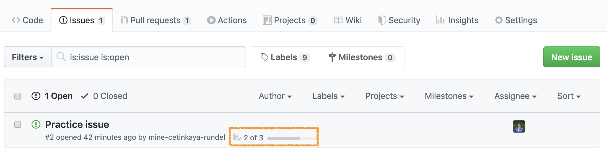

This week you'll be working on your projects. Here are a few to do items to get you started. Once
you complete these, use the rest of the time to, well, work on your project!

-   Remind yourself of the project assignment

-   Follow the link to GitHub Classroom - a private repository for the project will be created for
    you. It will be called `mp-2023-ds-project-TEAM_NAME`.

-   Go to the course organization on GitHub and clone the project repo.

-   Add your collaborators to your project by selecting: `Settings` --> `Collaborators and teams`
    --> `Manage access` --> `Add people`; give `Write` role.

-   Add your project title and team name to the `README.Rmd` file in the repo and commit and push
    your changes.  Observe that these are updated in the README of the repo.

-   Open the `presentation.Rmd` file, knit the document, and review the presentation format.  This
    is where your presentation will go.  Update the YAML with your project title, team name,
    etc. and commit and push your changes.

-   Go to your project repo on GitHub, click on **Settings** on the top right corner, and scroll
    down to the section titled **GiHub Pages**. Under **Source**, select `master` branch and the
    `root` folder. This will give you a URL where the website for your project will be automatically
    built from the content in your README.  This might take a few minutes.

    -   Once the website is built, pull changes to your project in RStudio.
    -   Take a look at your rendered project website. Click on the link in the presentation section
        and you should be able to view the rendered slides. This is the link we will use to project
        your slides during the presentations.
    -   On your repo you should see a text on top *No description, website, or topics
        provided.*. Next to it there's an **gear** button. Add a short description as well as the
        URL of your project website here.
    -   **Note:** This website is public, but your repository will remain private,unless... you as a
        team decide you would like to feature your repos in your personal GitHub profiles. If so, I
        will help you convert your repo to a public repo at the end of the semester. I will not add
        any marks to your repos so that your public work won't contain your score for the project.

-   Add your dataset to the `data` folder and add your codebook to the README in that folder.

    -   If in your proposal you were advised to update your codebook, make sure to make those
        updates.
    -   If you had R scripts you used to scrape your data, add them to this folder as well.

-   Add the content from your proposal to the `proposal.Rmd` file in the `proposal` folder.  Knit
    the document to make sure everything works and commit and push your proposal to your project
    repo.

    -   **Important:** Your data now lives in a folder called `data` that is *not* inside your
        proposal folder. So you need to specify the path to your data with
        `"../data/name_of_datafile"` in your `read_csv()` (or similar) function.
    -   You don't need to make further updates to your proposal at this point, even if your plans
        for the project change slightly.

-   Load your data in your `presentation.Rmd`, knit, and make sure everything works.  Commit and
    push your updated proposal to your project repo.

    -   **Important:** Same note as above! Your data now lives in a folder called `data` that is
        *not* inside your presentation folder. So you need to specify the path to your data with
        `"../data/name_of_datafile"` in your `read_csv()` (or similar) function.

-   Now that all the logistical details are done, start working on your project.

    -   Open issues for things you want to accomplish. Assign them to specific team member(s) if you
        like. And as you complete the tasks, close the issues. You can also use the issues for
        discussion on the specific tasks.

-   **Strongly recommended:** Get a hold of the instructor or a TA and run your ideas by them.


## Collaborating on GitHub and resolving merge conflicts

This is the first week you're working in teams on the projects, so we're going to make things a
little more interesting and let all of you make changes and push those changes to your project
repository. Sometimes things will go swimmingly, and sometimes you'll run into merge conflicts. So
our first task today is to walk you through a merge conflict!

-   Pushing to a repo replaces the code on GitHub with the code you have on your computer.
-   If a collaborator has made a change to your repo on GitHub that you haven't incorporated into
    your local work, GitHub will stop you from pushing to the repo because this could overwrite your
    collaborator's work!
-   So you need to explicitly "merge" your collaborator's work before you can push.
-   If your and your collaborator's changes are in different files or in different parts of the same
    file, git merges the work for you automatically when you \*pull\*.
-   If you both changed the same part of a file, git will produce a \*\*merge conflict\*\* because
    it doesn't know how which change you want to keep and which change you want to overwrite.

Git will put conflict markers in your code that look like:

    <<<<<<< HEAD 

    See also: [dplyr documentation](https://dplyr.tidyverse.org/)   

    ======= 

    See also [ggplot2 documentation](https://ggplot2.tidyverse.org/)  

    >>>>>>> some1alpha2numeric3string4

The `===`s separate *your* changes (top) from *their* changes (bottom).

Note that on top you see the word `HEAD`, which indicates that these are your changes.

And at the bottom you see `some1alpha2numeric3string4` (well, it probably looks more like
`28e7b2ceb39972085a0860892062810fb812a08f`).

This is the **hash** (a unique identifier) of the commit your collaborator made with the conflicting
change.

Your job is to *reconcile* the changes: edit the file so that it incorporates the best of both
versions and delete the `<<<`, `===`, and `>>>` lines.  Then you can stage and commit the result.

# Merge conflict activity

## Setup

-   Every team member should clone the project repository and open the `README.Rmd` file from the
    project's root directory.
-   Assign the numbers 1, 2, and 3 to each of the team members. If your team has fewer than 3
    people, some people will need to have multiple numbers. If your team has more than 3 people,
    some people will need to share some numbers.

## Let's cause a merge conflict!

Our goal is to see two different types of merges: first we'll see a type of merge that git can't
figure out on its own how to do on its own (a **merge conflict**) and requires human intervention,
then another type of where that git can figure out how to do without human intervention.

Doing this will require some tight choreography, so pay attention!

Take turns in completing the exercise, only one member at a time. **Others should just watch, not
doing anything on their own projects (this includes not even pulling changes!)** until they are
instructed to.  If you feel like you won't be able to resist the urge to touch your computer when
it's not your turn, we recommend putting your hands in your pockets or sitting on them!

**Before starting**: everyone should have the repo cloned and know which role number(s) they are.

## Resolving a merge conflict locally 

**Role 1:**

-   Change the team name to your actual team name.
-   Knit, commit, push.

🛑 Make sure the previous role has finished before moving on to the next step.

**Role 2:**

-   Change the team name to some other word.
-   Knit, commit, push. You should get an error.
-   Pull. Take a look at the document with the merge conflict. (If you don't see
    any changes in the document, execute the command in the `Console`: `git
    merge origin/master` or the command `git config pull.rebase false` to enable
    automatic merging with each pull.)
-   Clear the merge conflict by editing the document to choose the
    correct/preferred change.
-   Knit.
-   **Click the Stage checkbox** for all files in your Git tab. Make sure they
    all have check marks, not filled-in boxes.
-   Commit and push.

🛑 Make sure the previous role has finished before moving on to the next step.

**Role 3:**

-   Change the a label of the first code chunk
-   Knit, commit, push. You should get an error.
-   Pull. No merge conflicts should occur, but you should see a message about
    merging. (If you don't see the message of merging (and any changes applied
    to the document), execute the command in the `Console`: `git merge
    origin/master` or the command `git config pull.rebase false` to enable
    automatic merging with each pull.)
-   Now push.

🛑 Make sure the previous role has finished before moving on to the next step.

**Role 4:**

-   Change the label of the first code chunk to something other than previous
    role did.
-   Knit, commit, push. You should get an error.
-   Pull. Take a look at the document with the merge conflict. Clear the merge
    conflict by choosing the correct/preferred change. Commit, and push. (If you
    don't see any changes in the document after pulling, execute the following
    command in the `Console`: `git merge origin/master` or the command `git
    config pull.rebase false` to enable automatic merging with each pull.)

🛑 Make sure the previous role has finished before moving on to the next step.

**Everyone:** Pull, and observe the changes in your document.

## Resolving a merge conflict on GitHub
From GitHub documentation: „you can only resolve merge conflicts on GitHub that
are caused by competing line changes, such as when people make different changes
to the same line of the same file on different branches in your Git repository.
We ake different changes to the same line of the same file on different branches”

**Role 1:**

-   Change the team name to your actual team name.
-   Knit, commit, push to the master branch (the default one)

🛑 Make sure the previous role has finished before moving on to the next step.

**Role 2:**

-   Change the team name to some other word.
-   In the Git panel, click the `New Branch` button to create a new branch with
    the name `dev`
-   Knit, commit, push. 
-   On GitHub, you can verify that your repository has the new branch. While on
    GitHub, click on `branches` and then select `New pull request` next to the
    dev branch. You will see the "Comparing changes" section where you can
    verify that the master branch of your repository is on the left side and the
    dev branch is on the right side. If everything is set up properly, you
    should see the message: 'Can’t automatically merge: "Don’t worry, you can
    still create the pull request."
-   Click the button `Create pull request`. You should see a message: "This
    branch has conflicts that must be resolved." Click the button on the right,
    `Resolve conflicts`.
-   Clear the merge conflict by editing the document to choose the
    correct/preferred changes. After completion, click `Mark as resolved`, then
    click `Commit merge`, and finally, click `Merge pull request`.
-   Return to RStudio and make Pull."

You can swich between branches.

# Collaborating on GitHub with GitHub issues

Issues are a great way to keep track of tasks, enhancements, and bugs for your projects. They're
kind of like email---except they can be shared and discussed with the rest of your team. You can use
issues as to-do lists as well as a place for brainstorming / discussing ideas.

## Opening an issue

1.  Go to your project repo and open a new issue titled "Practice issue".
2.  Add the following text to the issue:

<!-- -->

```         
This is not a real issue. This is just some placeholder text.

And the following is a bulleted to-do list:
- [ ] Do this
- [ ] Then that
- [ ] And finally this
```

3.  Hit preview to make sure the issue looks like the following:

```{r}
knitr::include_graphics("img/practice-issue-create.png")
```

4.  Submit the issue.
5.  Then, assign the issue to one or few members of the team.

```{r}
knitr::include_graphics("img/practice-issue-assign.png")
```

## Working on the issue

As you work on the issue you can check the boxes.

```{r}
knitr::include_graphics("img/practice-issue-check.png")
```

Note that this will also show progress on the issue on the issue dashboard.

```{r}

```

6.  Check some of the boxes on your practice issue and confirm that you can see the progress result
    on the issue dashboard.

## Closing the issue

Once you're done with an issue, you should close it. You can do this in one of two ways: on GitHub
by clicking on Close issue or via a commit that directly addresses the issue.  We'll practice the
second one.  If you preface your commits with "Fixes", "Fixed", "Fix", "Closes", "Closed", or
"Close", the issue will be closed when you push the changes to your repo.

7.  Take a note of the issue number, which will show up next to the issue title.

```{r}
knitr::include_graphics("img/practice-issue-number.png")
```

8.  Go to your project on RStudio and make a change. This can be something silly like adding a new
    line to the issue README. Then commit this change. In your commit message, use one of the
    special words listed above and reference the issue. For example, if the change I made was to add
    a new line to the README I would say something like the following:

<!-- -->

```         
Add a new line to the README, closes #2
```

```{r}
knitr::include_graphics("img/practice-issue-commit.png")
```

9.  Push your changes and observe that the issue is now closed on GitHub. Click on the referenced
    commit to confirm that it was your last commit that closed the issue.

```{r}
knitr::include_graphics("img/practice-issue-commit.png")
```
